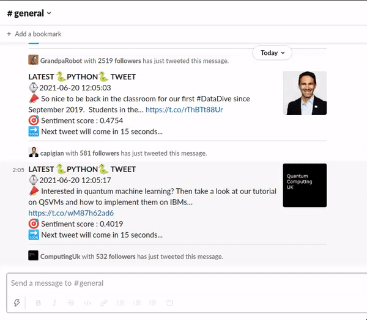

In this project, I built a data pippeline that collect tweets that mention 'Python' and stores them in Mongo database. Next, the sentiment of tweets is analyzed and the annotated tweets are stored in Postgres database. Finally, the latest tweet with sentiment score is published on Slack every 15 seconds.

